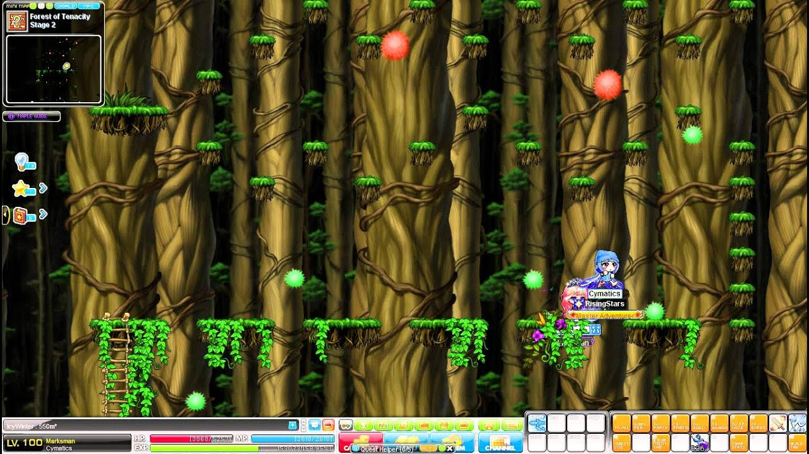
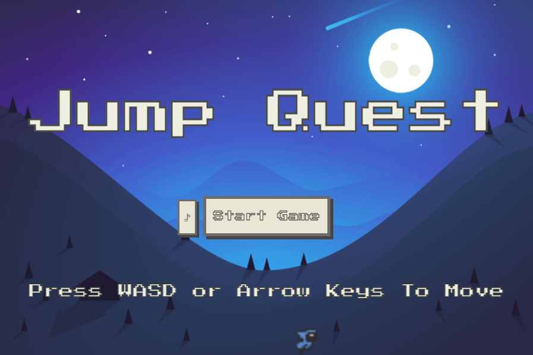
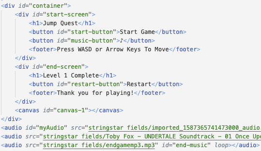
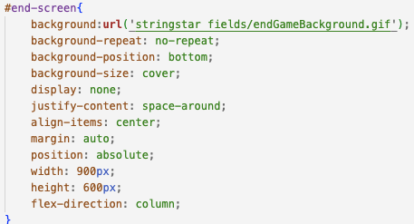
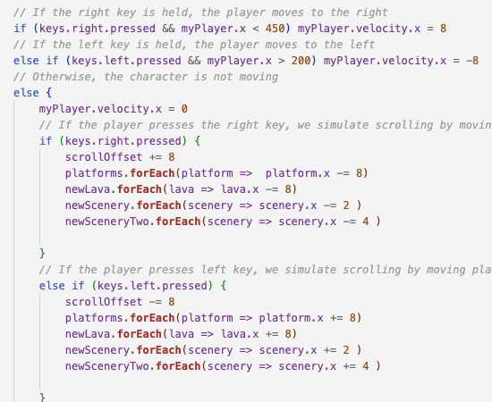

<h1><strong>Game Inspiration</strong></h1>

My project was inspired from a game quest from Maplestory called Jump Quest and the game Jump King. Jump quest is a quest where you'd have to jump up platforms and get through obstacles to reach the top to get a quest item. You'd usually fall down and get frustrated over and over again. I though I'd share the pain!

<h1><strong>Level Design</strong></h1>

For my start screen, I wanted to use an animated background and have a metroidvania feel, so I used a 8-bit font and merged the layers of the gif of my player and the gif of the background I found that I thought would match the theme of the game.

For the game, I found castle image assets and used an app called Tiled to take 16x16 pixel tiles and drew each platform individually. I also found separate background layers for the background and created parallax scrolling by having each background image move at different rates where the back would move faster than the foreground images. You have to traverse each platform and jump over the lava in order to reach the castle entrance!

For the restart screen, I took the framework of my start screen and changed the gifs.

<h1><strong>HTML</h1></strong></h1>

For the HTML Portion of the game, I mainly decided to use canvas so my code is quite short. It consists of a container with the start screen, game screen, and the end screen which all overlap each other. I have three audio elements for each screen.

<h1><strong>CSS</h1></strong></h1>

For the CSS, I decided to have the three screens overlap each other. I made each screen display = 'none' when either the start or end button was clicked. By default, start-screen is set to flex and the other two are set to none. I created a button for the start music on the start screen since Chrome doesn't allow autoplay for audio unless there's a page interaction. Each button has a hover and click animation. I set the color of the button to the dark spot of the moon so it would match better. 

<h1><strong>Javascript</strong></h1>

By far the most intense portion of coding! First, I set the DOM elements to variables that I can access. I set all the global variables and created functions for each state of the game from start to end. When each state starts, the function runs displaying the current game state and audio.

I created classes for each object that I needed to render. I needed my player which would have position, dimensions for the character image size of 16x16px, velocity to move the character, states of movement (left, right, run, stand), and the image for the character. I created a render function and update function which would create the character on the page and constantly update the position. If my character was above the canvas height, my character would be constantly falling down. The character animates by cutting out one image out of four characters on a sheet. It would go from index 0 to 3 and cycle again. It ended up refreshing too fast, so I had to add a stagger to the frames so that the animation pace would slow down. 

The platform class consists of a position and dimensions according to the image I created. It has a render function to create each platform on screen.

I created a scenery class that performs like the platform class, but can't be interacted with.

I created all the objects and put the key presses into states. If a certain state was triggered in response to key inputs, my objects would move. I created a function that would reset all elements if the player height + position dropped below the canvas. I set a scrolloffset so I could keep track of where my character was on the page horizontally. If I reached a certain distance, the game would end and the restart screen would appear while the other two screens displayed none. I created an animate function that would render everything over time according to how often the screen refreshes. I had a problem where I was coding at 240hz and my game would in reality be slower at 60hz since it refreshed each frame 1/4 the speed of my other monitor. I had to set an interval for animation to match to 60hz and adjust the speed and gravity of everything. In my animation, I made the platforms move while my character stands still after reaching a certain position on the canvas which mimicks movement. Lastly, I set the event listeners for key codes of wasd and arrow keys.

<h1><strong>Afterthoughts</strong></h1>

My favorite snippet of code was here! I created parallax scrolling and simulated side scrolling movement by letting my player, a square, move left and right until it hit a certain position on the x-axis. After that point, the platforms and scenery would move left or right instead of the player. I vary the speeds for each object making it so that if the object is closer relatively to the player, it moves at faster. 

I really had fun making this game. It was extremely hard. My favorite part of the game was creating the graphics for it. If I had time, I would create more levels, animate the lava, and give different animations for the character. 

<h1><strong>Resources Used</strong></h1>

Photopea - Image Layering and Animation 'https://www.photopea.com/'

Itch.io - Background and character image assets 'https://itch.io/'

Tiled - Tilesheet Image editor 'https://www.mapeditor.org/'

Undertale Theme Music - Start, Main, and End Screen Music 'https://tobyfox.bandcamp.com/album/undertale-soundtrack'